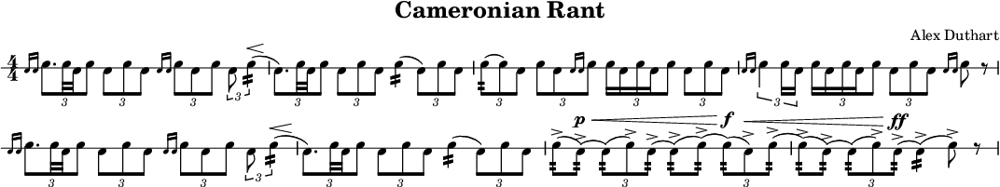

# Pipe Band Drumming with Lilypond

These are support files for writing pipe band drum scores with lilypond.

## Requirements

 * Install [Lilypond](https://lilypond.org)
 * Install [Frescobaldi](https://frescobaldi.org) (not strictly necessary, but highly recommended)

## Using these Support Files

1. Download [pipe-band-drumming.ly](pipe-band-drumming.ly) and one of the templates to get started.
2. Rename the template to something that makes sense to you, then open it up with Frescobaldi and get scoring!

## Things to know

* Make sure the `.ly` files are all sitting next to each other in the same directory.

